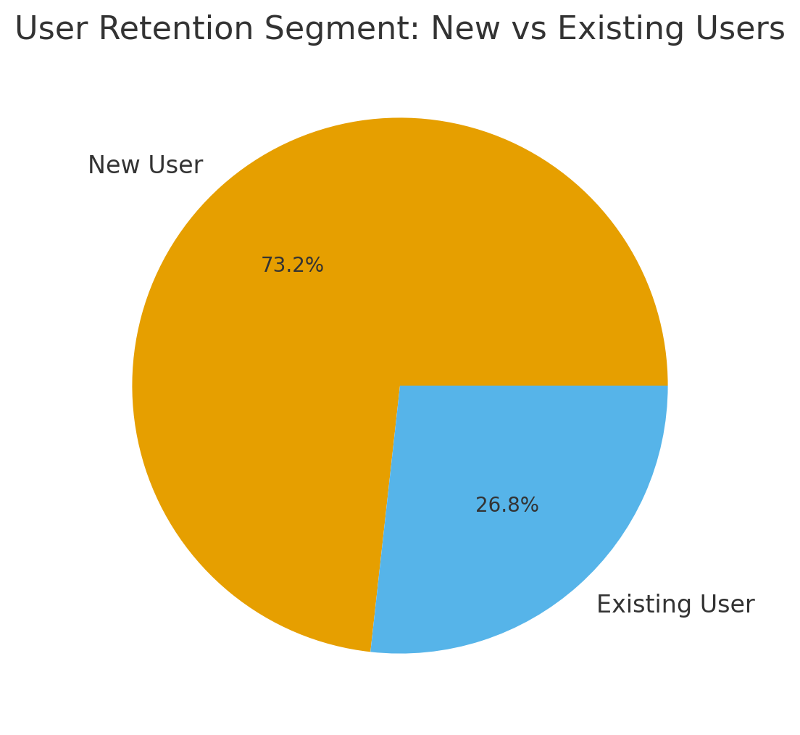
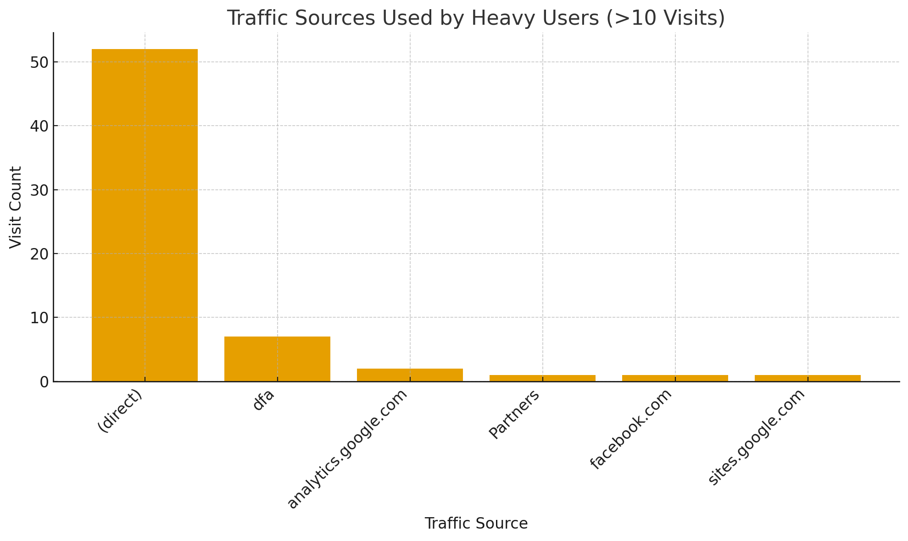
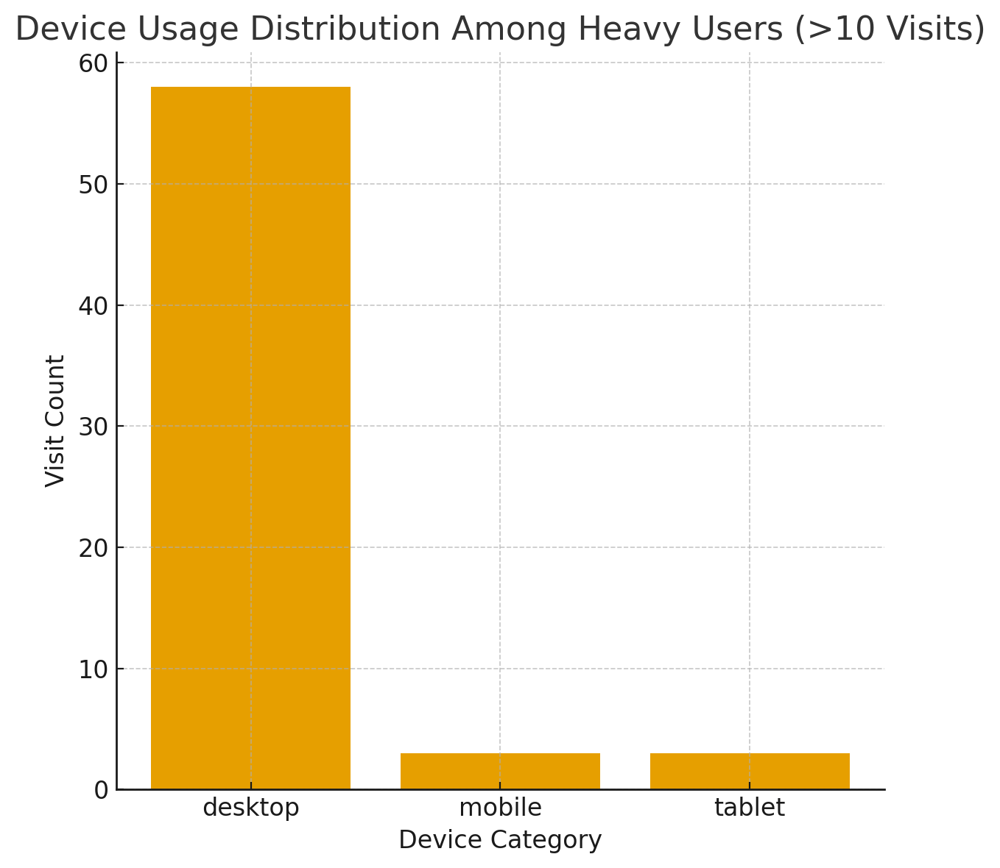
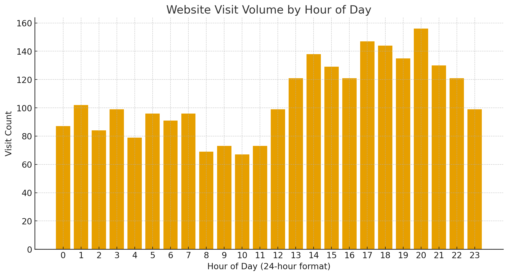
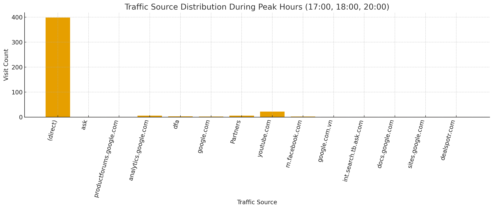
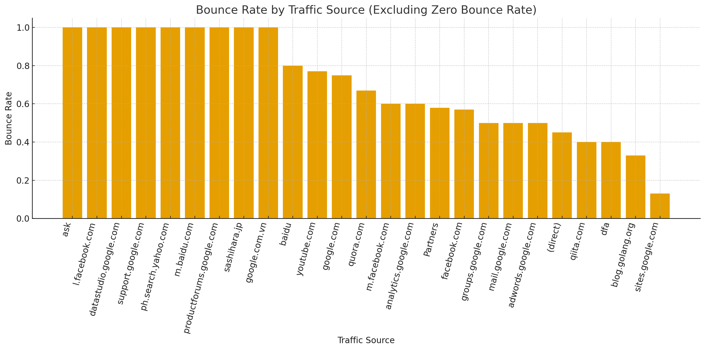
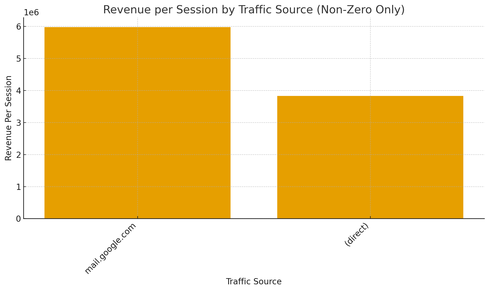
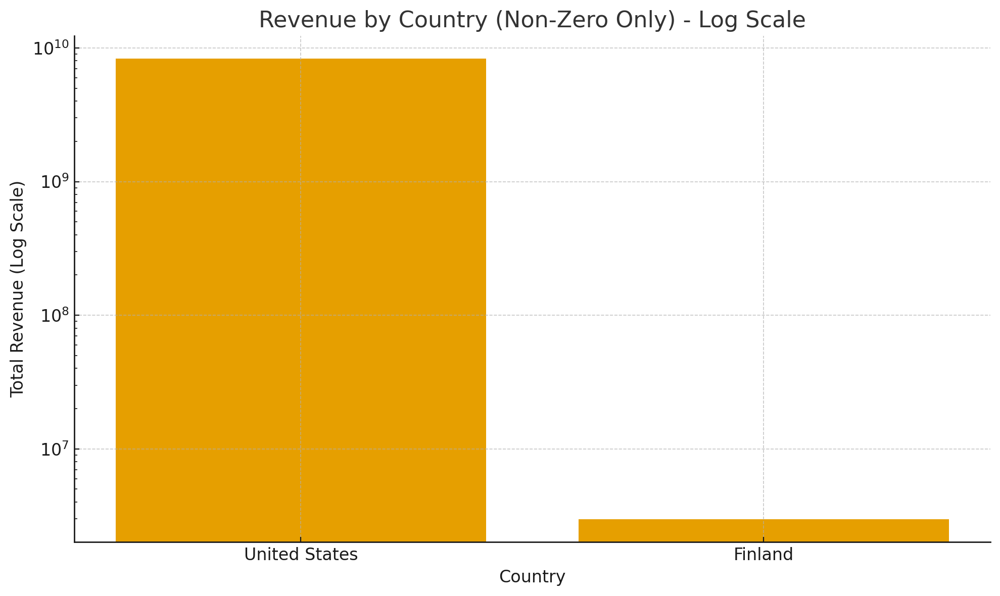

# Introduction
This project analyzes Google Analytics data for a single day using SQL queries in Google BigQuery. It includes exploratory and targeted analyses to extract actionable insights about user behavior, engagement, retention, and revenue patterns from raw analytics data.


Dataset used can be accessed here: [`bigquery-public-data.google_analytics_sample.ga_sessions_20170801`](https://console.cloud.google.com/bigquery?p=bigquery-public-data&d=google_analytics_sample&page=dataset&project=aayushi0719&ws=!1m9!1m3!3m2!1sbigquery-public-data!2sgoogle_analytics_sample!1m4!4m3!1sbigquery-public-data!2sgoogle_analytics_sample!3sga_sessions_20170801)

Please review the SQL queries here: [sql_files folder](/sql_files/)


# Project Overview
I am performing exploratory analysis on Google Analytics sample data. I started with understanding the different visit components of the data and how fullVisitorId, visitId, and visitNumber interact to define users, sessions, and nth visits. I used window functions to compute visitor retention percentages and segmented traffic into new vs existing users. Further, I identified users with 10+ lifetime visits, categorizing them as heavy users, and investigated whether these high-retention users consistently returned via the same traffic source and device. This helps identify which channels and platforms are most important for repeat engagement and where to prioritize UX or personalization efforts.

I then analyzed engagement metrics (pageviews, hits, and bounces) by traffic source and device category to understand which entry points and platforms drive deeper session depth. I examined hourly traffic patterns to identify peak usage windows and combined this with traffic source analysis to see how users typically arrive during high-demand hours. Next, I performed a simple funnel-style analysis (sessions → views → transactions → revenue) to estimate drop-off rates and approximate conversion efficiency.

Finally, I looked at revenue contribution by traffic source and country to see where value is concentrated. Overall, this analysis demonstrates how to use BigQuery and SQL to move from raw web analytics data to retention, engagement, and monetization insights that can inform product, UX, and growth decisions.

# Tools I Used
- **Google BigQuery**: Used for storing and querying the sample dataset. Since the analysis was performed on a single day’s data, the full scalability and power of BigQuery were not required.
- **SQL**: For data extraction, transformation, and analysis.
- **Google Analytics**: As the primary data source.
- **CSV/Excel**: For exporting and visualizing results.
- **Git/GitHub**: For version control and project collaboration.

# The Analysis
### The questions I wanted to answer through my SQL queries were:

#### 1. How do fullVisitorId, visitId, and visitNumber relate to user identification and session tracking in Google Analytics data?

```sql
SELECT
  fullVisitorId,
  COUNT(fullVisitorId) AS repeating_user
FROM
  `bigquery-public-data.google_analytics_sample.ga_sessions_20170801`
GROUP BY
  fullVisitorId
ORDER BY
  repeating_user DESC;
-- => This tells me that the fullVisitorId (user) is repeating

--- Let's check if the visitId is also repeating
SELECT
  fullVisitorId,
  visitId,
  COUNT(fullVisitorId) AS repeating_user
FROM
  `bigquery-public-data.google_analytics_sample.ga_sessions_20170801`
GROUP BY
  fullVisitorId, visitId
ORDER BY
  repeating_user DESC;
-- => -- This tells me that there is a single distinct visitId per fullVisitorId.
SELECT
  visitId,
  COUNT(visitId) AS repeating_visitId
FROM
  `bigquery-public-data.google_analytics_sample.ga_sessions_20170801`
GROUP BY
  visitId
ORDER BY
  repeating_visitId DESC;
-- => the above two queries imply that the visitId is repeating but not within a single fullVisitorId. Upon doing some research, I find out that a visitId can repeat because it refers to timestamp-based session identifier. It is the same for all those users who visit the website at the same time on the same day.

-- Further queried to see what visitNumber is all about
WITH repeat_user_table AS (
  SELECT
    m.fullVisitorId,
    COUNT(m.fullVisitorId) AS cnt_user
  FROM
    `bigquery-public-data.google_analytics_sample.ga_sessions_20170801` AS m
  GROUP BY
    m.fullVisitorId
  HAVING
    COUNT(m.fullVisitorId) >1
  ORDER BY
    cnt_user DESC
)

SELECT
  m.fullVisitorId,
  m.visitNumber
FROM
  `bigquery-public-data.google_analytics_sample.ga_sessions_20170801` AS m
  INNER JOIN repeat_user_table AS r ON m.fullVisitorId = r.fullVisitorId
ORDER BY
  m.fullVisitorId DESC;
-- => Found out that there are different visitNumber for the same user. So, I did some research and understood that this is not the total number of visits by a user, which I was initially thinking, but instead it is the serial number for the nth visit of the user. Eg. #6 means it is the 6th time the user is visiting.

```

**Summary:** fullVisitorId identifies unique users, visitId marks individual sessions (which can repeat across users visiting at the same time), and visitNumber indicates the nth visit for each user.

#### 2. What percentage of sessions come from returning users versus new users in a single day?

```sql
SELECT
  CASE
    WHEN m.visitNumber = 1 THEN 'New User'
    ELSE 'Existing User'
  END AS user_category,
  COUNT(m.visitId) AS sessions,
  ROUND(COUNT(m.visitId) / SUM(COUNT(m.visitId)) OVER() * 100, 2) AS pct_user_category
FROM
  `bigquery-public-data.google_analytics_sample.ga_sessions_20170801` AS m
GROUP BY
  user_category;
/*
Row	user_category	sessions	pct_user_category
1	New User	1872	73.24
2	Existing User	684	26.76

=> Insight: Almost 27% of all sessions have returning users (visitNumber > 1), indicating strong short-term retention for a single day of traffic. It is a high retention rate for a random single day of data. A retention rate of this magnitude suggests that the site has a loyal core user base even without multi-day behavioral data.
*/
```



**Summary:** Nearly 27% of sessions are from returning users, indicating strong short-term retention even within a single day.

#### 3. Do heavy users (those with 10+ lifetime visits) consistently return using the same device and traffic source, and which specific sources and devices are most common among them?

```sql
-- Traffic Source
WITH heavy_users AS (
  SELECT
    m.fullVisitorId
  FROM 
  `bigquery-public-data.google_analytics_sample.ga_sessions_20170801` as m
  GROUP BY 
    m.fullVisitorId
  HAVING 
    MAX(m.visitNumber) > 10
)

SELECT
  m.trafficSource.source,
  COUNT(m.trafficSource.source) AS trafficSource_cnt
FROM
  `bigquery-public-data.google_analytics_sample.ga_sessions_20170801` AS m
INNER JOIN heavy_users AS h ON m.fullVisitorId = h.fullVisitorId
GROUP BY
  m.trafficSource.source
ORDER BY
  trafficSource_cnt DESC;
/*
Row	source	trafficSource_cnt
1	(direct)	52
2	dfa	7
3	analytics.google.com	2
4	Partners	1
5	facebook.com	1
6	sites.google.com	1
*/

-- Device
WITH heavy_users AS (
  SELECT
    m.fullVisitorId
  FROM 
  `bigquery-public-data.google_analytics_sample.ga_sessions_20170801` as m
  GROUP BY 
    m.fullVisitorId
  HAVING 
    MAX(m.visitNumber) > 10
)

SELECT
  m.device.deviceCategory,
  COUNT(m.device.deviceCategory) AS device_cnt
FROM
  `bigquery-public-data.google_analytics_sample.ga_sessions_20170801` AS m
INNER JOIN heavy_users AS h ON m.fullVisitorId = h.fullVisitorId
GROUP BY
  m.device.deviceCategory
ORDER BY
  device_cnt DESC;
/*
Row	deviceCategory	device_cnt
1	desktop	58
2	mobile	3
3	tablet	3
*/
```




**Summary:** Yes—high-retention users always return via the same device and traffic source, most commonly direct on desktop, indicating strong habitual usage patterns.

#### 4. At what hours does the website receive the highest visit volume, and which traffic sources dominate during these peak periods?

```sql
-- Let's query to find out at what hour of the day the users visit the website the most
SELECT
  EXTRACT(HOUR FROM TIMESTAMP_SECONDS(m.visitStartTime)) AS hour_time,
  COUNT(m.visitId) AS visit_cnt
FROM
  `bigquery-public-data.google_analytics_sample.ga_sessions_20170801` AS m
GROUP BY
  hour_time
ORDER BY
  visit_cnt DESC;
/* For visit_cnt>100
Row	hour_time	visit_cnt
1	20	156
2	17	147
3	18	144
4	14	138
5	19	135
6	21	130
7	15	129
8	16	121
9	22	121
10	13	121
11	1	102
*/
-- => Insight: This informs us that most of the visits take place in the afternoon and the evening, especially after 12 and go on until 1 at night. Marketing pushes or product releases timed in this window may generate higher visibility and conversions.

-- Let's query to find out what traffic sources were used at the most demanded hour of the day
SELECT
  m.trafficSource.source AS source,
  COUNT(m.visitId) AS visit_cnt
FROM
  `bigquery-public-data.google_analytics_sample.ga_sessions_20170801` AS m
WHERE
  EXTRACT(HOUR FROM TIMESTAMP_SECONDS(m.visitStartTime)) IN (20, 17, 18)
GROUP BY
  source;
-- ==> the traffic source is direct at the top three most demanded hours of the day, reinforcing that users actively type or bookmark the site rather than coming from external referrals.
```




**Summary:** The website sees the most visits in the afternoon and evening (especially after 12 PM), with "direct" traffic being the leading source during these peak hours.

#### 5. How do engagement metrics (visits, hits, and pageviews) differ by traffic source and device category?

```sql
--- Let's see how many pageviews, hits and visits are recieved by each device and through each traffic source 
-- Traffic Source
SELECT
  m.trafficSource.source AS source,
  COUNT(m.visitId) AS total_visits,
  SUM(m.totals.hits) AS total_hits,
  SUM(m.totals.pageviews) AS total_pageViews,
  ROUND(SUM(m.totals.hits)/COUNT(m.visitId)) AS hit_ratio,
  ROUND(SUM(m.totals.pageviews)/COUNT(m.visitId)) pageView_ratio
FROM
  `bigquery-public-data.google_analytics_sample.ga_sessions_20170801` AS m
GROUP BY
  source;
/*
Row	source	total_visits	total_hits	total_pageViews	hit_ratio	pageView_ratio
1	(direct)	2166	12291	10069	6.0	5.0
2	analytics.google.com	57	114	113	2.0	2.0
3	adwords.google.com	2	7	7	4.0	4.0
-------
34	pinterest.com	1	11	7	11.0	7.0
35	dealspotr.com	1	23	19	23.0	19.0
==>Insight: Although 'direct' has the highest visits, hits, and pageviews, the highest hit_ratio and pageView_ratio is of 'dealspotr.com'. And the most interesting part about this is that this source has 23 hits and 19 pageviews on 1 visit, suggesting hyper-motivated traffic. It would be nice to see the difference between the user interface of this source and the 'direct' source. But another thing to remember is that it has only 1 visit. So, I think it is difficult to get a user to that website, but then once they reach there, they find it interesting.
*/

-- Device Category
SELECT
  m.device.deviceCategory AS device,
  COUNT(m.visitId) AS total_visits,
  SUM(m.totals.hits) AS total_hits,
  SUM(m.totals.pageviews) AS total_pageViews,
  ROUND(SUM(m.totals.hits)/COUNT(m.visitId)) AS hit_ratio,
  ROUND(SUM(m.totals.pageviews)/COUNT(m.visitId)) pageView_ratio
FROM
  `bigquery-public-data.google_analytics_sample.ga_sessions_20170801` AS m
GROUP BY
  device;
/*
Row	device	total_visits	total_hits	total_pageViews	hit_ratio	pageView_ratio
1	desktop	1742	10206	8329	6.0	5.0
2	mobile	725	2716	2332	4.0	3.0
3	tablet	89	311	278	3.0	3.0
==> Desktop users show 50–70% higher engagement than mobile/tablet users across all metrics, indicating that the mobile experience likely introduces friction. Improving mobile navigation, page load, or layout could significantly increase session depth.
*/
```

**Summary:** Desktop users show 50–70% higher engagement than mobile/tablet users, and while "direct" traffic brings the most visits, some niche sources drive exceptionally high engagement per visit.

#### 6. What percentage of users complete a purchase after viewing the website, and where does the biggest drop-off occur in the conversion funnel?

```sql
-- Let's query to understand where users drop off as they move through a sequence of steps
SELECT
  COUNT(m.visitId) AS sessions,
  SUM(CASE WHEN m.totals.pageviews > 0 THEN 1 ELSE 0 END) AS viewed,
  SUM(CASE WHEN m.totals.transactions > 0 THEN 1 ELSE 0 END) AS added_to_cart,
  SUM(CASE WHEN m.totals.transactions > 0 THEN 1 ELSE 0 END)/SUM(CASE WHEN m.totals.pageviews > 0 THEN 1 ELSE 0 END) AS ratio_transaction,
  SUM(CASE WHEN m.totals.transactionRevenue > 0 THEN 1 ELSE 0 END) AS purchased,
  SUM(CASE WHEN m.totals.transactionRevenue > 0 THEN 1 ELSE 0 END)/SUM(CASE WHEN m.totals.pageviews > 0 THEN 1 ELSE 0 END) AS ratio_purchased
FROM
  `bigquery-public-data.google_analytics_sample.ga_sessions_20170801` AS m;

-- => I am assuming NULL = NO PURCHASE. Based on this assumption, we observe that people do view the website, but off those only ~1.7% people make the purchase and complete the transaction, showing a sharp drop-off between browsing and purchasing. This points toward checkout friction or lack of purchase intent during this sampled period.
```

**Summary:** Only about 1.7% of visitors make a purchase after viewing the site, indicating a sharp drop-off between browsing and buying—likely due to checkout friction or low purchase intent.

#### 7. Which traffic sources have the highest bounce rates, and what does this indicate about user intent and landing page experience?

```sql
-- Let us query the bounce rate. A bounce = ONE visit where user left immediately.
SELECT
  m.trafficSource.source,
  COUNT(m.visitId) AS sessions,
  SUM(IFNULL(m.totals.bounces,0)) AS bounces,
  ROUND(SUM(IFNULL(m.totals.bounces,0))/COUNT(m.visitId),2) AS bounce_rate
FROM
  `bigquery-public-data.google_analytics_sample.ga_sessions_20170801` AS m
GROUP BY
  m.trafficSource.source
ORDER BY
  bounces DESC;
/*
Row	source	sessions	bounces	bounce_rate
1	(direct)	2166	985	0.45
2	youtube.com	180	139	0.77
3	analytics.google.com	57	34	0.6
4	Partners	52	30	0.58
5	google.com	12	9	0.75
6	dfa	15	6	0.4
*/
-- => bounce rate ranges from 0 to 1. 'direct' traffic source has the highest number of bounces but its bounce rate is less than 0.5. Other important traffic sources with a greater than 0.5 bounce rate are 'youtube.com', 'analytics.google.com', 'Partners', 'google.com' and many more, indicating mismatch between user intent and landing page experience. As we already saw under engagement ratios, 'dealspotr.com' had a hit_ratio and pageview_ratio, we expected it to have 0 bounce rate which it does. 
```


**Summary:** Sources like YouTube and Google.com have bounce rates above 0.5, suggesting a mismatch between user intent and the landing page, while "direct" traffic, despite high visit volume, has a lower bounce rate.

#### 8. Which traffic sources generate the most revenue, and how does revenue per session compare across sources?

```sql
SELECT
  m.trafficSource.source AS source,
  COUNT(m.visitId) AS sessions,
  SUM(IFNULL(m.totals.transactionRevenue,0)) AS revenue,
  ROUND(SUM(IFNULL(m.totals.transactionRevenue,0))/COUNT(m.visitId),2) AS revenue_per_session
FROM
  `bigquery-public-data.google_analytics_sample.ga_sessions_20170801` AS m
GROUP BY 
  source
ORDER BY 
  revenue DESC;
/*
Revenue is only generated from two sources. The total revenue and the per session revenue by those sources is reflected below.
Row	source	sessions	revenue	revenue_per_session
1	(direct)	2166	8292980000	3828707.29
2	mail.google.com	2	11960000	5980000.0
=> Although '(direct)' generates the majority of revenue volume, Gmail traffic produces 1.56× higher revenue per session, indicating a higher purchase intent segment. Increasing outreach via Gmail campaigns could materially increase revenue even with lower number of visitors.
*/
```


**Summary:** While "direct" traffic brings in the most total revenue, Gmail traffic yields 1.56× higher revenue per session, highlighting its high purchase intent despite lower volume.

#### 9. Which countries generate revenue?

```sql
SELECT
  m.geoNetwork.country,
  SUM(IFNULL(m.totals.transactionRevenue,0)) AS revenue,
FROM 
  `bigquery-public-data.google_analytics_sample.ga_sessions_20170801` AS m
GROUP BY 
  country
ORDER BY 
  revenue DESC;
/*
Row	country	revenue
1	United States	8301950000
2	Finland	2990000
=> Only 2 countries generate revenue. It is important to think why other countries are not generating revenue. They are generating exactly 0 revenue. Even tiny markets generate a few transactions. Even low-intent countries convert a little. However, since this dataset is a curated analytics demo, the absence of revenue in other countries is almost certainly due to data limitations, not actual business performance. This suggests a data acquisition constraint.
*/
```


*Note: A logarithmic scale was used to visualize revenue by country, as the revenue generated by the United States was much higher than that of Finland.*


**Summary:** Only the United States and Finland generate revenue—likely due to data limitations in the sample, not actual business performance.

# Recommendations

### Recommendation 1 — Retention Focus
Direct traffic drives high engagement and revenue → invest in improving direct paths (eg. app bookmark).

### Recommendation 2 — Improve Mobile UX
Mobile users show half the engagement → critical area for UX improvements.

### Recommendation 3 — Target High-Intent Sources
Dealspotr and Gmail produce highest engagement and highest revenue per visit → expand collaborations here.

### Recommendation 4 — Increase evening-time campaigns
Peak traffic occurs between 12:00–22:00 → allocate marketing spends optimally in peak hours.

# Conclusions
This project demonstrates the power of combining Google Analytics data with BigQuery and SQL for in-depth analysis. The insights generated can inform marketing strategies, product improvements, and business decisions.
